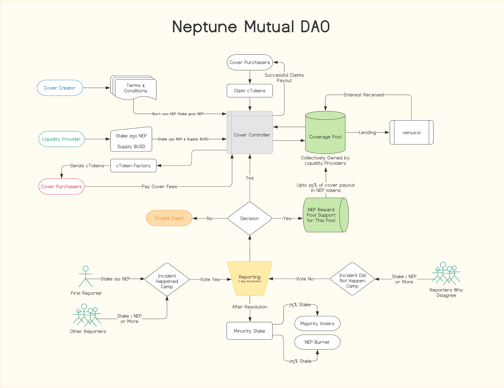

# Neptune Mutual Covers



## Contract Creators

Anyone who has NEP tokens can create a cover contract. To avoid spam, questionable, and confusing cover contracts, a creator has to burn 1000 NEP tokens. Additionally, the contract creator also needs to stake 4000 NEP tokens or more. The higher the sake, the more visibility the contract gets if there are multiple cover contracts with the same name or similar terms.

### Rewards

The contract creator will earn a steady income of 1% of all cover fees paid by the users. Initial contract creators will also earn additional 1% of the cover fees in NEP.


**About Reporting Questionable or Invalid Contracts**

The governance system allows NEP holders to vote to invalidate and remove any cover contract.

- The staked NEP tokens of the contract creator will be burned.
- The users having non-expired covers can withdraw their cover fee.
- The liquidity providers can withdraw their staked NEP tokens, stable-coins, and cover fees.

## Liquidity Providers

The liquidity providers can evaluate a cover contract and ensure that it is up to their satisfaction. One can then provide liquidity in BUSD or other supported cryptocurrency. A liquidity provider needs to also stake 250 NEP or higher.

### Farming Strategy

To maximize return on investment, 25% of the idle/uncovered assets in the liquidity pool is supplied to Venus Protocol for lending. The interest received on loan is capitalized back into the liquidity pool, shared amongst all liquidity providers. The platform will deduct 2% of the profit generated to purchase (and burn) NEP tokens from decentralized exchange(s).

> This feature will be available starting from the Neptune Mutual Protocol v2.

### Cover Fees

The liquidity providers collectively earn cover fees paid by the platform users. Initial liquidity provider will receive additional 10% rewards in NEP tokens.


[comment]: #solidoc (Start)
# Protobase.sol

View Source: [contracts/Protobase.sol](/contracts/Protobase.sol)

**↗ Extends: [Recoverable](docs/Recoverable.md)**
**↘ Derived Contracts: [Protocol](docs/Protocol.md)**

**Protobase**

## Contract Members
**Constants & Variables**

```js
contract IStore public s;

```

**Events**

```js
event ContractUpgraded(address indexed previous, address indexed current);
```

## Modifiers

- [onlyProtocol](#onlyprotocol)

### onlyProtocol

This modifier ensures that the caller is one of the latest protocol contracts

```js
modifier onlyProtocol(address contractAddress) internal
```

**Arguments**

| Name        | Type           | Description  |
| ------------- |------------- | -----|
| contractAddress | address |  | 

## Functions

- [_getMemberHash(address contractAddress)](#_getmemberhash)
- [(IStore store)](#)
- [vaultWithdrawal(bytes32 contractName, bytes32 key, IERC20 asset, address recipient, uint256 amount)](#vaultwithdrawal)
- [vaultDeposit(bytes32 contractName, bytes32 key, IERC20 asset, address sender, uint256 amount)](#vaultdeposit)
- [upgradeContract(bytes32 name, address previous, address current)](#upgradecontract)
- [_addContract(bytes32 name, address contractAddress)](#_addcontract)
- [_deleteContract(bytes32 name, address contractAddress)](#_deletecontract)

### _getMemberHash

This function ensures that the supplied address is one of the latest protocol contracts

```js
function _getMemberHash(address contractAddress) internal view
returns(bytes32)
```

**Arguments**

| Name        | Type           | Description  |
| ------------- |------------- | -----|
| contractAddress | address |  | 

### 

```js
function (IStore store) internal nonpayable
```

**Arguments**

| Name        | Type           | Description  |
| ------------- |------------- | -----|
| store | IStore |  | 

### vaultWithdrawal

```js
function vaultWithdrawal(bytes32 contractName, bytes32 key, IERC20 asset, address recipient, uint256 amount) public nonpayable nonReentrant onlyProtocol 
```

**Arguments**

| Name        | Type           | Description  |
| ------------- |------------- | -----|
| contractName | bytes32 |  | 
| key | bytes32 |  | 
| asset | IERC20 |  | 
| recipient | address |  | 
| amount | uint256 |  | 

### vaultDeposit

```js
function vaultDeposit(bytes32 contractName, bytes32 key, IERC20 asset, address sender, uint256 amount) public nonpayable nonReentrant onlyProtocol 
```

**Arguments**

| Name        | Type           | Description  |
| ------------- |------------- | -----|
| contractName | bytes32 |  | 
| key | bytes32 |  | 
| asset | IERC20 |  | 
| sender | address |  | 
| amount | uint256 |  | 

### upgradeContract

```js
function upgradeContract(bytes32 name, address previous, address current) external nonpayable onlyOwner 
```

**Arguments**

| Name        | Type           | Description  |
| ------------- |------------- | -----|
| name | bytes32 |  | 
| previous | address |  | 
| current | address |  | 

### _addContract

```js
function _addContract(bytes32 name, address contractAddress) private nonpayable onlyProtocol 
```

**Arguments**

| Name        | Type           | Description  |
| ------------- |------------- | -----|
| name | bytes32 |  | 
| contractAddress | address |  | 

### _deleteContract

```js
function _deleteContract(bytes32 name, address contractAddress) private nonpayable onlyProtocol 
```

**Arguments**

| Name        | Type           | Description  |
| ------------- |------------- | -----|
| name | bytes32 |  | 
| contractAddress | address |  | 

## Contracts

* [Address](docs/Address.md)
* [Context](docs/Context.md)
* [Cover](docs/Cover.md)
* [CoverLiquidity](docs/CoverLiquidity.md)
* [CoverProvision](docs/CoverProvision.md)
* [CoverStake](docs/CoverStake.md)
* [CoverUtilV1](docs/CoverUtilV1.md)
* [ICover](docs/ICover.md)
* [ICoverLiquidity](docs/ICoverLiquidity.md)
* [ICoverStake](docs/ICoverStake.md)
* [IERC20](docs/IERC20.md)
* [IMember](docs/IMember.md)
* [IProtocol](docs/IProtocol.md)
* [IStore](docs/IStore.md)
* [IVault](docs/IVault.md)
* [NTransferUtilV2](docs/NTransferUtilV2.md)
* [Ownable](docs/Ownable.md)
* [Pausable](docs/Pausable.md)
* [Protobase](docs/Protobase.md)
* [Protocol](docs/Protocol.md)
* [ProtoUtilV1](docs/ProtoUtilV1.md)
* [Recoverable](docs/Recoverable.md)
* [ReentrancyGuard](docs/ReentrancyGuard.md)
* [SafeERC20](docs/SafeERC20.md)
* [SafeMath](docs/SafeMath.md)
* [Vault](docs/Vault.md)

[comment]: #solidoc (End)
