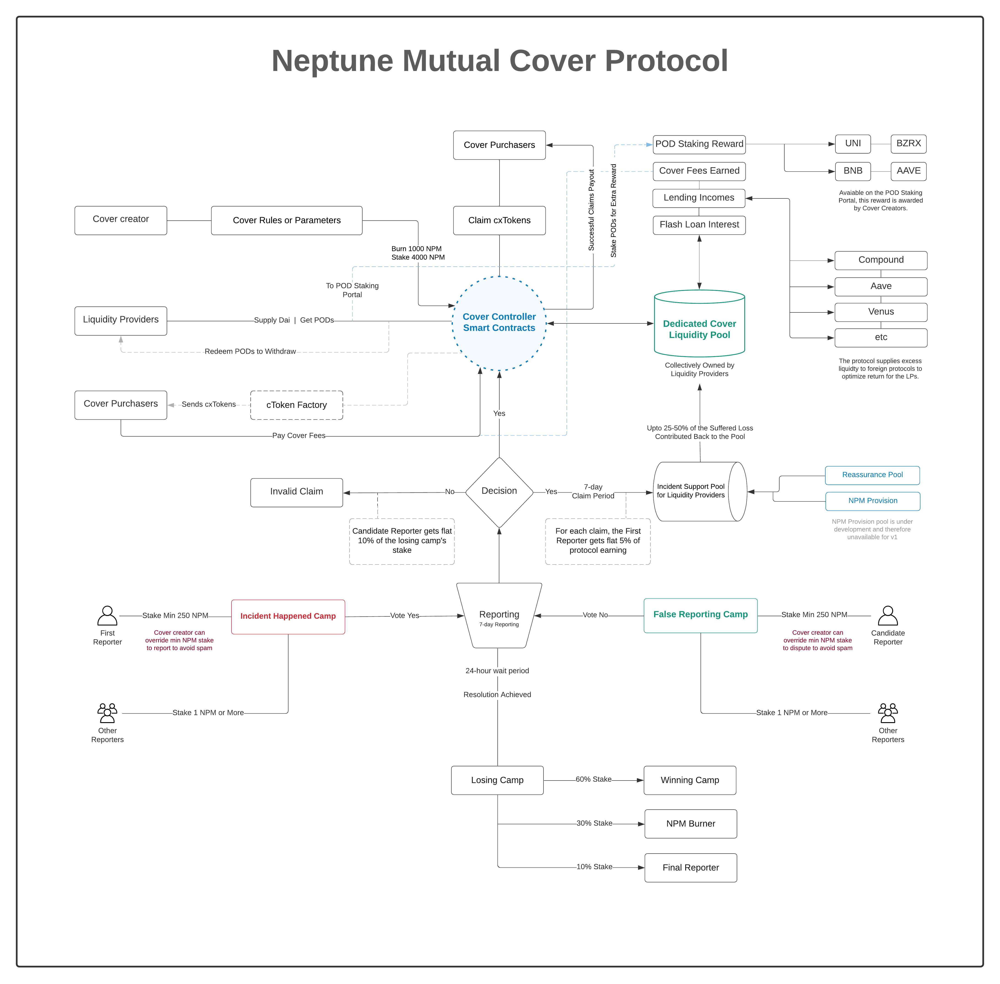

## Neptune Mutual Cover



Anyone who has NPM tokens can create a cover contract. To avoid spam, questionable, and confusing cover contracts, a creator has to burn 1000 NPM tokens. Additionally, the contract creator also needs to stake 4000 NPM tokens or more. The higher the sake, the more visibility the contract gets if there are multiple cover contracts with the same name or similar terms.

[Read More](https://docs.neptunemutual.com/sdk/quickstart)

[comment]: #solidoc Start
# Cover Contract (Cover.sol)

View Source: [contracts/core/lifecycle/Cover.sol](/contracts/core/lifecycle/Cover.sol)

**↗ Extends: [CoverBase](docs/CoverBase.md)**

**Cover**

The cover contract facilitates you create and update covers

## Functions

- [constructor(IStore store)](#)
- [updateCover(bytes32 key, bytes32 info)](#updatecover)
- [addCover(bytes32 key, bytes32 info, address reassuranceToken, bool requiresWhitelist, uint256[] values)](#addcover)
- [deployVault(bytes32 key)](#deployvault)
- [stopCover(bytes32 key, string reason)](#stopcover)
- [updateCoverCreatorWhitelist(address account, bool status)](#updatecovercreatorwhitelist)
- [updateCoverUsersWhitelist(bytes32 key, address[] accounts, bool[] statuses)](#updatecoveruserswhitelist)
- [checkIfWhitelistedCoverCreator(address account)](#checkifwhitelistedcovercreator)
- [checkIfWhitelistedUser(bytes32 key, address account)](#checkifwhitelisteduser)

### 

Constructs this contract

```solidity
function (IStore store) public nonpayable CoverBase 
```

**Arguments**

| Name        | Type           | Description  |
| ------------- |------------- | -----|
| store | IStore | Enter the store | 

<details>
	<summary><strong>Source Code</strong></summary>

```javascript
constructor(IStore store) CoverBase(store) {}
```
</details>

### updateCover

Updates the cover contract.
 This feature is accessible only to the cover owner or protocol owner (governance).

```solidity
function updateCover(bytes32 key, bytes32 info) external nonpayable nonReentrant 
```

**Arguments**

| Name        | Type           | Description  |
| ------------- |------------- | -----|
| key | bytes32 | Enter the cover key | 
| info | bytes32 | Enter a new IPFS URL to update | 

<details>
	<summary><strong>Source Code</strong></summary>

```javascript
function updateCover(bytes32 key, bytes32 info) external override nonReentrant {
    s.mustNotBePaused();
    s.mustHaveNormalCoverStatus(key);
    s.senderMustBeCoverOwnerOrAdmin(key);

    require(s.getBytes32ByKeys(ProtoUtilV1.NS_COVER_INFO, key) != info, "Duplicate content");

    s.updateCoverInternal(key, info);
    emit CoverUpdated(key, info);
  }
```
</details>

### addCover

Adds a new coverage pool or cover contract.
 To add a new cover, you need to pay cover creation fee
 and stake minimum amount of NPM in the Vault. <br /> <br />
 Through the governance portal, projects will be able redeem
 the full cover fee at a later date. <br /> <br />
 **Apply for Fee Redemption** <br />
 https://docs.neptunemutual.com/covers/cover-fee-redemption <br /><br />
 As the cover creator, you will earn a portion of all cover fees
 generated in this pool. <br /> <br />
 Read the documentation to learn more about the fees: <br />
 https://docs.neptunemutual.com/covers/contract-creators

```solidity
function addCover(bytes32 key, bytes32 info, address reassuranceToken, bool requiresWhitelist, uint256[] values) external nonpayable nonReentrant 
```

**Arguments**

| Name        | Type           | Description  |
| ------------- |------------- | -----|
| key | bytes32 | Enter a unique key for this cover | 
| info | bytes32 | IPFS info of the cover contract | 
| reassuranceToken | address | **Optional.** Token added as an reassurance of this cover. <br /><br />  Reassurance tokens can be added by a project to demonstrate coverage support  for their own project. This helps bring the cover fee down and enhances  liquidity provider confidence. Along with the NPM tokens, the reassurance tokens are rewarded  as a support to the liquidity providers when a cover incident occurs. | 
| requiresWhitelist | bool | If set to true, this cover will only support whitelisted addresses. | 
| values | uint256[] | [0] stakeWithFee Enter the total NPM amount (stake + fee) to transfer to this contract. | 

<details>
	<summary><strong>Source Code</strong></summary>

```javascript
function addCover(
    bytes32 key,
    bytes32 info,
    address reassuranceToken,
    bool requiresWhitelist,
    uint256[] memory values
  ) external override nonReentrant {
    // @suppress-acl Can only be called by a whitelisted address
    // @suppress-acl Marking this as publicly accessible
    // @suppress-address-trust-issue The reassuranceToken can only be the stablecoin supported by the protocol for this version.
    s.mustNotBePaused();
    s.senderMustBeWhitelistedCoverCreator();

    require(values[0] >= s.getUintByKey(ProtoUtilV1.NS_COVER_CREATION_MIN_STAKE), "Your stake is too low");
    require(reassuranceToken == s.getStablecoin(), "Invalid reassurance token");

    s.addCoverInternal(key, info, reassuranceToken, requiresWhitelist, values);
    emit CoverCreated(key, info, requiresWhitelist);
  }
```
</details>

### deployVault

```solidity
function deployVault(bytes32 key) external nonpayable nonReentrant 
returns(address)
```

**Arguments**

| Name        | Type           | Description  |
| ------------- |------------- | -----|
| key | bytes32 |  | 

<details>
	<summary><strong>Source Code</strong></summary>

```javascript
function deployVault(bytes32 key) external override nonReentrant returns (address) {
    s.mustNotBePaused();
    s.mustHaveStoppedCoverStatus(key);

    s.senderMustBeCoverOwnerOrAdmin(key);

    address vault = s.deployVaultInternal(key);
    emit VaultDeployed(key, vault);

    return vault;
  }
```
</details>

### stopCover

Enables governance admin to stop a spam cover contract

```solidity
function stopCover(bytes32 key, string reason) external nonpayable nonReentrant 
```

**Arguments**

| Name        | Type           | Description  |
| ------------- |------------- | -----|
| key | bytes32 | Enter the cover key you want to stop | 
| reason | string | Provide a reason to stop this cover | 

<details>
	<summary><strong>Source Code</strong></summary>

```javascript
function stopCover(bytes32 key, string memory reason) external override nonReentrant {
    s.mustNotBePaused();
    s.mustHaveNormalCoverStatus(key);
    AccessControlLibV1.mustBeGovernanceAdmin(s);

    s.stopCoverInternal(key);
    emit CoverStopped(key, msg.sender, reason);
  }
```
</details>

### updateCoverCreatorWhitelist

Adds or removes an account to the cover creator whitelist.
 For the first version of the protocol, a cover creator has to be whitelisted
 before they can call the `addCover` function.

```solidity
function updateCoverCreatorWhitelist(address account, bool status) external nonpayable nonReentrant 
```

**Arguments**

| Name        | Type           | Description  |
| ------------- |------------- | -----|
| account | address | Enter the address of the cover creator | 
| status | bool | Set this to true if you want to add to or false to remove from the whitelist | 

<details>
	<summary><strong>Source Code</strong></summary>

```javascript
function updateCoverCreatorWhitelist(address account, bool status) external override nonReentrant {
    s.mustNotBePaused();
    AccessControlLibV1.mustBeCoverManager(s);

    s.updateCoverCreatorWhitelistInternal(account, status);
    emit CoverCreatorWhitelistUpdated(account, status);
  }
```
</details>

### updateCoverUsersWhitelist

```solidity
function updateCoverUsersWhitelist(bytes32 key, address[] accounts, bool[] statuses) external nonpayable nonReentrant 
```

**Arguments**

| Name        | Type           | Description  |
| ------------- |------------- | -----|
| key | bytes32 |  | 
| accounts | address[] |  | 
| statuses | bool[] |  | 

<details>
	<summary><strong>Source Code</strong></summary>

```javascript
function updateCoverUsersWhitelist(
    bytes32 key,
    address[] memory accounts,
    bool[] memory statuses
  ) external override nonReentrant {
    s.mustNotBePaused();
    AccessControlLibV1.mustBeCoverManager(s);
    s.senderMustBeCoverOwnerOrAdmin(key);

    s.updateCoverUsersWhitelistInternal(key, accounts, statuses);
  }
```
</details>

### checkIfWhitelistedCoverCreator

Signifies if a given account is a whitelisted cover creator

```solidity
function checkIfWhitelistedCoverCreator(address account) external view
returns(bool)
```

**Arguments**

| Name        | Type           | Description  |
| ------------- |------------- | -----|
| account | address |  | 

<details>
	<summary><strong>Source Code</strong></summary>

```javascript
function checkIfWhitelistedCoverCreator(address account) external view override returns (bool) {
    return s.getAddressBooleanByKey(ProtoUtilV1.NS_COVER_CREATOR_WHITELIST, account);
  }
```
</details>

### checkIfWhitelistedUser

Signifies if a given account is a whitelisted user

```solidity
function checkIfWhitelistedUser(bytes32 key, address account) external view
returns(bool)
```

**Arguments**

| Name        | Type           | Description  |
| ------------- |------------- | -----|
| key | bytes32 |  | 
| account | address |  | 

<details>
	<summary><strong>Source Code</strong></summary>

```javascript
function checkIfWhitelistedUser(bytes32 key, address account) external view override returns (bool) {
    return s.getAddressBooleanByKeys(ProtoUtilV1.NS_COVER_USER_WHITELIST, key, account);
  }
```
</details>

## Contracts

* [AaveStrategy](docs/AaveStrategy.md)
* [AccessControl](docs/AccessControl.md)
* [AccessControlLibV1](docs/AccessControlLibV1.md)
* [Address](docs/Address.md)
* [BaseLibV1](docs/BaseLibV1.md)
* [BokkyPooBahsDateTimeLibrary](docs/BokkyPooBahsDateTimeLibrary.md)
* [BondPool](docs/BondPool.md)
* [BondPoolBase](docs/BondPoolBase.md)
* [BondPoolLibV1](docs/BondPoolLibV1.md)
* [CompoundStrategy](docs/CompoundStrategy.md)
* [console](docs/console.md)
* [Context](docs/Context.md)
* [Cover](docs/Cover.md)
* [CoverBase](docs/CoverBase.md)
* [CoverLibV1](docs/CoverLibV1.md)
* [CoverProvision](docs/CoverProvision.md)
* [CoverReassurance](docs/CoverReassurance.md)
* [CoverStake](docs/CoverStake.md)
* [CoverUtilV1](docs/CoverUtilV1.md)
* [cxToken](docs/cxToken.md)
* [cxTokenFactory](docs/cxTokenFactory.md)
* [cxTokenFactoryLibV1](docs/cxTokenFactoryLibV1.md)
* [Delayable](docs/Delayable.md)
* [Destroyable](docs/Destroyable.md)
* [ERC165](docs/ERC165.md)
* [ERC20](docs/ERC20.md)
* [FakeAaveLendingPool](docs/FakeAaveLendingPool.md)
* [FakeCompoundDaiDelegator](docs/FakeCompoundDaiDelegator.md)
* [FakeRecoverable](docs/FakeRecoverable.md)
* [FakeStore](docs/FakeStore.md)
* [FakeToken](docs/FakeToken.md)
* [FakeUniswapPair](docs/FakeUniswapPair.md)
* [FakeUniswapV2FactoryLike](docs/FakeUniswapV2FactoryLike.md)
* [FakeUniswapV2PairLike](docs/FakeUniswapV2PairLike.md)
* [FakeUniswapV2RouterLike](docs/FakeUniswapV2RouterLike.md)
* [FaultyAaveLendingPool](docs/FaultyAaveLendingPool.md)
* [FaultyCompoundDaiDelegator](docs/FaultyCompoundDaiDelegator.md)
* [Finalization](docs/Finalization.md)
* [ForceEther](docs/ForceEther.md)
* [Governance](docs/Governance.md)
* [GovernanceUtilV1](docs/GovernanceUtilV1.md)
* [IAaveV2LendingPoolLike](docs/IAaveV2LendingPoolLike.md)
* [IAccessControl](docs/IAccessControl.md)
* [IBondPool](docs/IBondPool.md)
* [IClaimsProcessor](docs/IClaimsProcessor.md)
* [ICompoundERC20DelegatorLike](docs/ICompoundERC20DelegatorLike.md)
* [ICover](docs/ICover.md)
* [ICoverProvision](docs/ICoverProvision.md)
* [ICoverReassurance](docs/ICoverReassurance.md)
* [ICoverStake](docs/ICoverStake.md)
* [ICxToken](docs/ICxToken.md)
* [ICxTokenFactory](docs/ICxTokenFactory.md)
* [IERC165](docs/IERC165.md)
* [IERC20](docs/IERC20.md)
* [IERC20Detailed](docs/IERC20Detailed.md)
* [IERC20Metadata](docs/IERC20Metadata.md)
* [IERC3156FlashBorrower](docs/IERC3156FlashBorrower.md)
* [IERC3156FlashLender](docs/IERC3156FlashLender.md)
* [IFinalization](docs/IFinalization.md)
* [IGovernance](docs/IGovernance.md)
* [ILendingStrategy](docs/ILendingStrategy.md)
* [ILiquidityEngine](docs/ILiquidityEngine.md)
* [IMember](docs/IMember.md)
* [InvalidStrategy](docs/InvalidStrategy.md)
* [IPausable](docs/IPausable.md)
* [IPolicy](docs/IPolicy.md)
* [IPolicyAdmin](docs/IPolicyAdmin.md)
* [IPriceDiscovery](docs/IPriceDiscovery.md)
* [IProtocol](docs/IProtocol.md)
* [IRecoverable](docs/IRecoverable.md)
* [IReporter](docs/IReporter.md)
* [IResolution](docs/IResolution.md)
* [IResolvable](docs/IResolvable.md)
* [IStakingPools](docs/IStakingPools.md)
* [IStore](docs/IStore.md)
* [IUniswapV2FactoryLike](docs/IUniswapV2FactoryLike.md)
* [IUniswapV2PairLike](docs/IUniswapV2PairLike.md)
* [IUniswapV2RouterLike](docs/IUniswapV2RouterLike.md)
* [IUnstakable](docs/IUnstakable.md)
* [IVault](docs/IVault.md)
* [IVaultDelegate](docs/IVaultDelegate.md)
* [IVaultFactory](docs/IVaultFactory.md)
* [IWitness](docs/IWitness.md)
* [LiquidityEngine](docs/LiquidityEngine.md)
* [MaliciousToken](docs/MaliciousToken.md)
* [MockCxToken](docs/MockCxToken.md)
* [MockCxTokenPolicy](docs/MockCxTokenPolicy.md)
* [MockCxTokenStore](docs/MockCxTokenStore.md)
* [MockFlashBorrower](docs/MockFlashBorrower.md)
* [MockProcessorStore](docs/MockProcessorStore.md)
* [MockProcessorStoreLib](docs/MockProcessorStoreLib.md)
* [MockProtocol](docs/MockProtocol.md)
* [MockStore](docs/MockStore.md)
* [MockVault](docs/MockVault.md)
* [NPM](docs/NPM.md)
* [NTransferUtilV2](docs/NTransferUtilV2.md)
* [NTransferUtilV2Intermediate](docs/NTransferUtilV2Intermediate.md)
* [Ownable](docs/Ownable.md)
* [Pausable](docs/Pausable.md)
* [Policy](docs/Policy.md)
* [PolicyAdmin](docs/PolicyAdmin.md)
* [PolicyHelperV1](docs/PolicyHelperV1.md)
* [PoorMansERC20](docs/PoorMansERC20.md)
* [PriceDiscovery](docs/PriceDiscovery.md)
* [PriceLibV1](docs/PriceLibV1.md)
* [Processor](docs/Processor.md)
* [ProtoBase](docs/ProtoBase.md)
* [Protocol](docs/Protocol.md)
* [ProtoUtilV1](docs/ProtoUtilV1.md)
* [Recoverable](docs/Recoverable.md)
* [ReentrancyGuard](docs/ReentrancyGuard.md)
* [RegistryLibV1](docs/RegistryLibV1.md)
* [Reporter](docs/Reporter.md)
* [Resolution](docs/Resolution.md)
* [Resolvable](docs/Resolvable.md)
* [RoutineInvokerLibV1](docs/RoutineInvokerLibV1.md)
* [SafeERC20](docs/SafeERC20.md)
* [StakingPoolBase](docs/StakingPoolBase.md)
* [StakingPoolCoreLibV1](docs/StakingPoolCoreLibV1.md)
* [StakingPoolInfo](docs/StakingPoolInfo.md)
* [StakingPoolLibV1](docs/StakingPoolLibV1.md)
* [StakingPoolReward](docs/StakingPoolReward.md)
* [StakingPools](docs/StakingPools.md)
* [Store](docs/Store.md)
* [StoreBase](docs/StoreBase.md)
* [StoreKeyUtil](docs/StoreKeyUtil.md)
* [StrategyLibV1](docs/StrategyLibV1.md)
* [Strings](docs/Strings.md)
* [TimelockController](docs/TimelockController.md)
* [Unstakable](docs/Unstakable.md)
* [ValidationLibV1](docs/ValidationLibV1.md)
* [Vault](docs/Vault.md)
* [VaultBase](docs/VaultBase.md)
* [VaultDelegate](docs/VaultDelegate.md)
* [VaultDelegateBase](docs/VaultDelegateBase.md)
* [VaultDelegateWithFlashLoan](docs/VaultDelegateWithFlashLoan.md)
* [VaultFactory](docs/VaultFactory.md)
* [VaultFactoryLibV1](docs/VaultFactoryLibV1.md)
* [VaultLibV1](docs/VaultLibV1.md)
* [VaultLiquidity](docs/VaultLiquidity.md)
* [VaultStrategy](docs/VaultStrategy.md)
* [WithFlashLoan](docs/WithFlashLoan.md)
* [WithPausability](docs/WithPausability.md)
* [WithRecovery](docs/WithRecovery.md)
* [Witness](docs/Witness.md)

[comment]: #solidoc End
